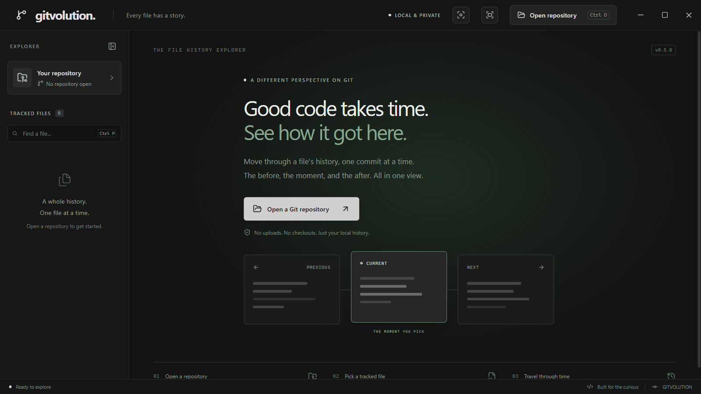
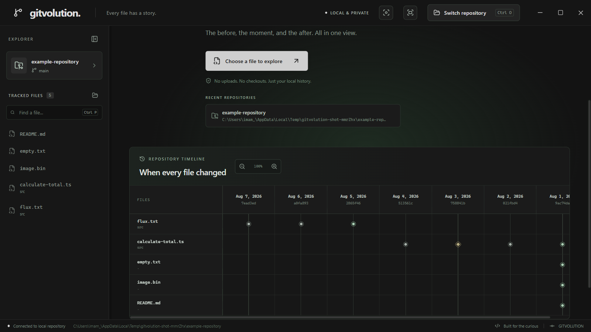
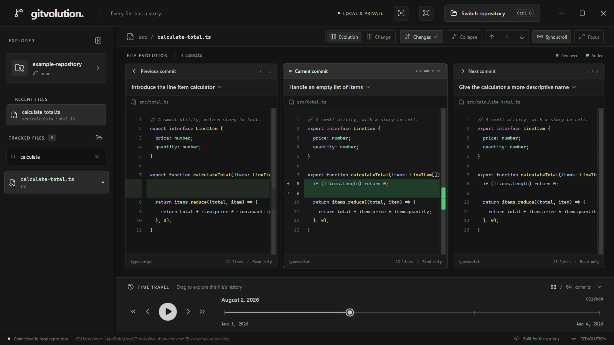
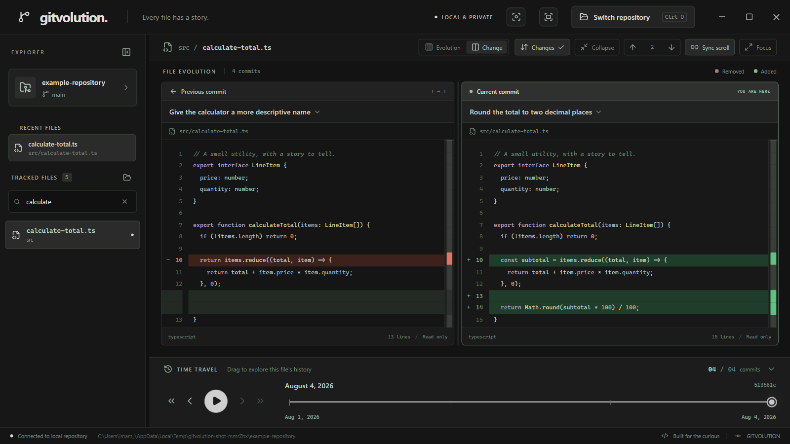
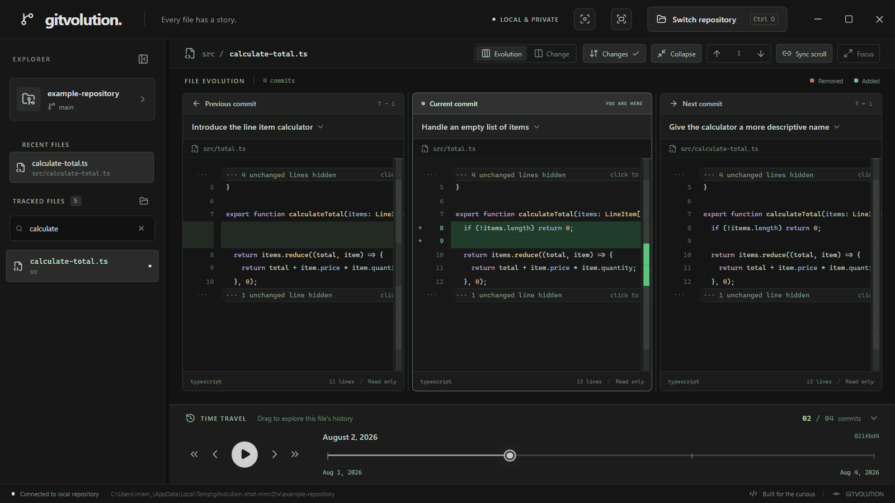

# Gitvolution

A local, read-only Electron app for exploring when repository files changed and how each Git-tracked file evolved over time.

Select a repository, pick a file, and scrub through its history. Three syntax-highlighted panels show the **previous**, **current**, and **next** revisions of that file, without checking out commits or touching your working tree.

## Screenshots

Captured from the current desktop build at 1600 x 900.

Welcome screen:



The repository timeline, with files as rows and commit dates across the horizontal time axis:



The three-panel **Evolution** view, with the previous, current, and next revisions padded and aligned:



The two-panel **Change** view for a single commit, with removed and added lines highlighted:



The **Collapse** mode, which folds unchanged lines into expandable gaps:



These were generated from a temporary Git repository. Regenerate them with:

```sh
node scripts/capture-screenshots.mjs
```

## Run

Requires **Node.js 22.12+** (or 24 LTS) and **Git on your PATH**.

```sh
npm install
npm start
```

On Windows, use `npm.cmd` instead of `npm` if PowerShell blocks `npm.ps1`.

For development with live UI updates:

```sh
npm run dev
```

Restart the development command after changing files in `electron/`.

## Explore

1. Click **Open a Git repository** and choose a working-tree folder. Nested folders and linked worktrees also work; bare repositories are not supported.
2. Scan the repository timeline to see when each currently tracked file changed. Files run vertically, commit dates run horizontally, and rename history maps to the current filename. Use the zoom controls to adjust the timeline from 70% to 150%.
3. Select a file from its timeline row, search the tracked file list, or use the folder button to choose one from disk.
4. Drag the file timeline to a commit. The center shows that revision; the left and right show the adjacent commits that changed this file, not unrelated repository commits.
5. Use the previous/next buttons, jump to the first/latest revision, or press Play to step through the history automatically. Click the file breadcrumb to return to the repository overview.

The viewer starts at the latest file revision. History follows renames, so each panel shows the filename as it existed in that commit. Removed lines are highlighted on the left, additions to the selected revision in the center, and additions in the following revision on the right. The three panels are padded so unchanged lines stay on the same row across all of them, and scroll together. **Changes** toggles highlighting; **Sync scroll** links horizontal and vertical scrolling.

To focus on what actually changed, toggle **Collapse**. Unchanged code folds away behind `··· n unchanged lines hidden` markers, leaving only the changed lines and a little context around each. Click a marker to reveal that block again. Use the **jump** controls — or the `Up`/`Down` arrow keys (and `N`/`P`) — to hop between change hunks in the selected commit; the current one is highlighted and scrolled into view.

Recently opened repositories are remembered and remain listed in the sidebar and repository home screen, so you can reopen one with a single click.

| Shortcut         | Action                      |
| ---------------- | --------------------------- |
| `Ctrl/Cmd + O`   | Open or switch repository   |
| `Ctrl/Cmd + P`   | Focus file search           |
| `Left` / `Right` | Previous / next file commit |
| `Up` / `Down`   | Previous / next change hunk |
| `N` / `P`        | Next / previous change hunk |

The range slider also supports its native arrow keys. The explorer can be collapsed to give the code more room.

## Behavior

- Everything stays local. No accounts, uploads, analytics, or network services. The recent-repository list is stored in the app's own local storage.
- Only committed content is shown, never uncommitted working-tree edits. A staged file without commits shows an empty history.
- The repository overview and file histories are snapshots of the branch and HEAD when opened. Reopen it after external commits, branch switches, or changes to the tracked file list.
- Only files currently in the index are selectable. History can show a selected file's earlier deletion and re-addition, but the explorer does not list files deleted from the current index.
- The slider advances one file-changing commit per step, not a fixed time interval. Dates shown are author dates; ancestor order is preserved even when dates are out of order.
- Empty, missing/deleted, binary, and non-UTF-8 revisions have explicit states. Text previews are limited to 2 MiB and 10,000 lines. Large diffs may skip highlighting, and large text previews skip syntax coloring.
- Git commands have bounded output and a 30-second timeout. Git errors are shown in the app.

## Verify And Package

```sh
npm test
npm run test:e2e
npm run build
npm run package
```

`npm test` creates temporary Git repositories and covers history ordering, renames, merges, deletions, snapshots, binary/large files, path handling, worktrees, SHA-256 repositories, and read-only behavior. The Electron end-to-end test opens a real desktop window and exercises the full viewer using a temporary repository. It requires a desktop session (or a virtual display on Linux).

`npm run package` produces an installer for the current platform in `release/`: NSIS on Windows, DMG on macOS, or AppImage on Linux. Signing and notarization are not configured. Git must also be installed on the target machine.

## Implementation

Electron handles native dialogs and read-only Git subprocesses. A sandboxed, context-isolated preload exposes narrowly scoped IPC methods to a React/TypeScript UI built with Vite. The renderer cannot access Node.js or run arbitrary Git commands; revision access is restricted to history retrieved from the selected repository.

## License

[MIT](LICENSE) © 2026 Mohamad Imam Firdaus
